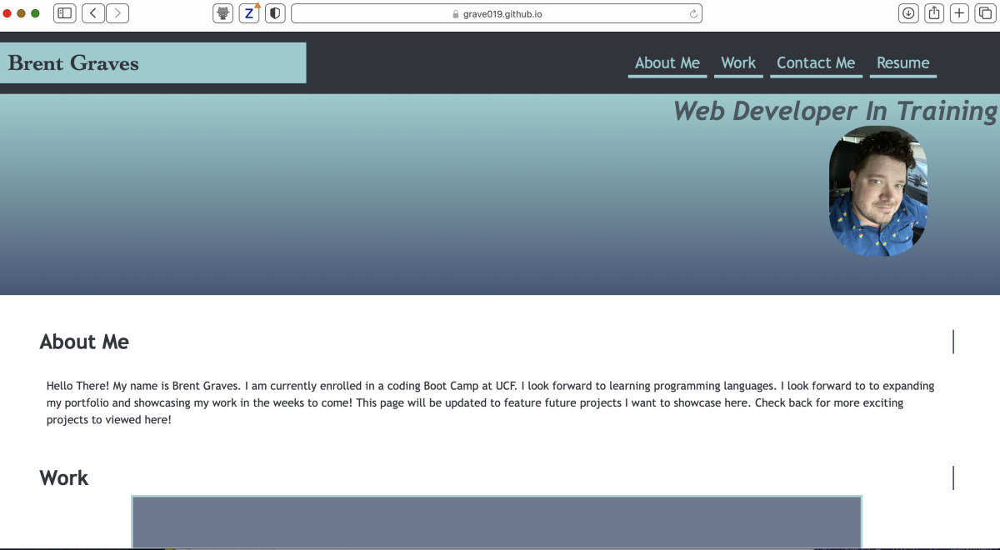

# Advanced CSS Portfolio

## 1.Overview

## 2.Project Goals

## 3.Reflection

## 4.Preview of My Page

## Link to the Web Page

## Credits

### 1.Overview

Creating a portfolio page to showcase future projects.

### 2.Meeting Goals

Today more and more people are using phones or tablets to search the web. In order to keep up the new wave of handheld technology. Websites need to be written to showcase information on a smaller screen. With advanced CSS you can have optically pleasing pages that format the page to give the user a easier way to navigate the page. In my project I used pseudo elements and psuedo classes such as hover and first child to give my flex boxes a visually appealing style that animates the images. In addition, I arranged the flexboxes to appear different when viewing in a larger screen and the boxes are arranged in single collumn format to provide easier use for mobile users. All links in the page work and redirect you to other projects. Please note that there are placeholders on the page because the page will be updated in the future to showcase more projects.

All links are currently working on the web page. A CSS reset was used and linked before the first CSS style sheet to help better loading across different browsers. Using the flexbox style my page looks differently in a desktop vs mobile browser due to implementing styling using @ for setting width at a different number of pixels. I will continue to update this page to make it run more efficiently in the future.

### 3. Reflection

Currently my page does not function how I would like it to. I plan on troubleshooting my page in the future and get a better grasp on the concepts of advanced CSS. I believe I am on the right track but still need work on my skills. I know I can accomplish this though additional hard work and refractoring my page. 

### 3. Preview of My Page

### 4. Click the following link below to the visit the CSS Page

<https://grave019.github.io/advanced-css-project/>

### 5. Credits

Thank you for taking the time to view my portfolio project. If you have any ideas on how to make the website better please feel free to submit a pull request.
